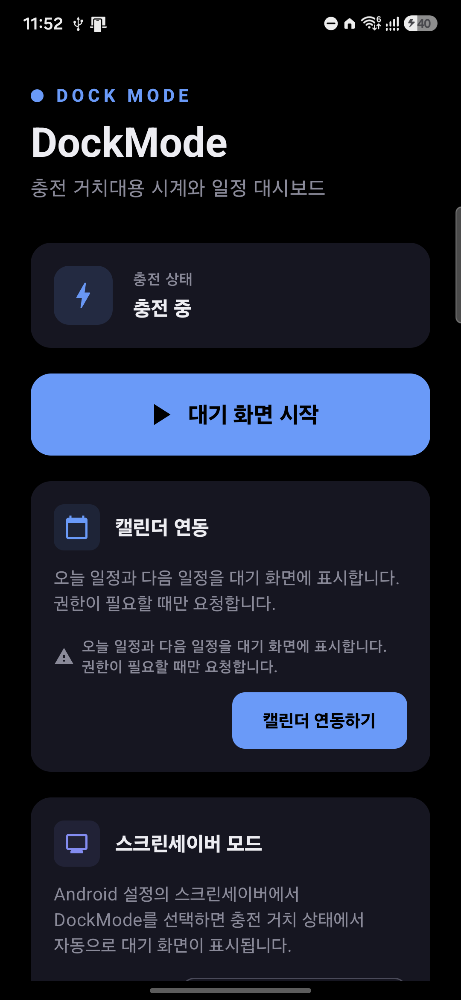
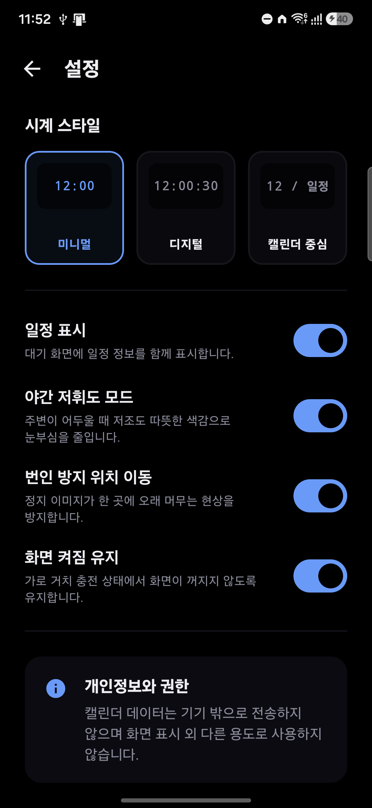
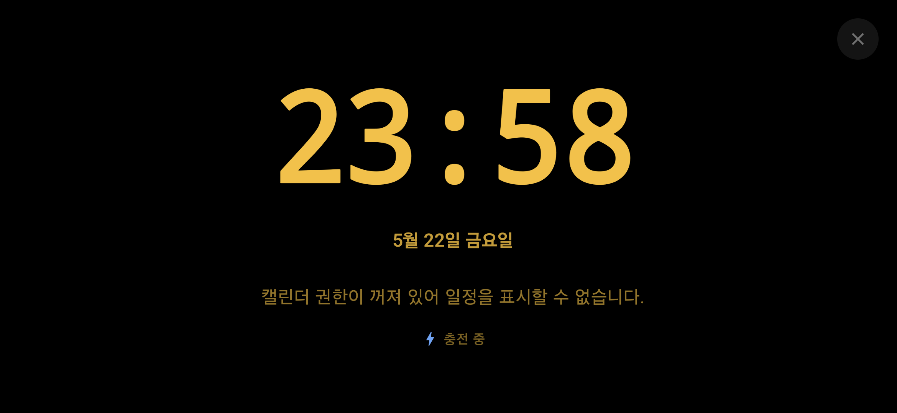
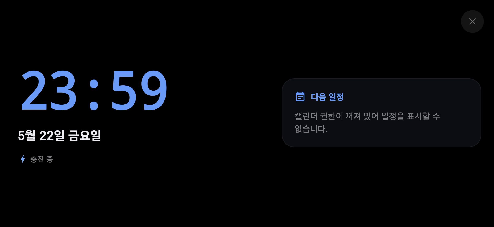
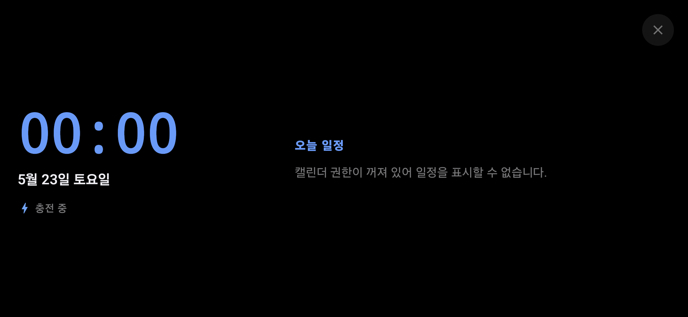

# DockMode

[](https://github.com/jeiel85/dockmode-android/actions/workflows/android-ci.yml)
[](https://jeiel85.github.io/dockmode-android/)
[](#라이선스)

Android 충전 거치대용 시계·달력 대시보드 앱입니다.

DockMode는 스마트폰을 충전 스탠드에 올려둔 상태에서 가로 화면으로 시간, 날짜, 오늘 일정, 다음 일정을 보기 좋게 표시하는 Android 네이티브 앱입니다. iPhone StandBy와 유사한 사용 맥락을 목표로 하지만, 구현은 Android의 공식 기능과 정책을 따르는 독립 앱입니다.

> 현재 앱명은 작업용 이름입니다. Play Store 출시 전 이름 중복, 상표, 스토어 정책 검토가 필요합니다.

랜딩 페이지: **<https://jeiel85.github.io/dockmode-android/>**

## 프로젝트 식별값

| 항목 | 값 | 비고 |
|---|---|---|
| Project Name | `DockMode` | 사용자 노출 작업명 |
| Project Code | `DKM-ANDROID` | 이슈, 브랜치, 문서 태그용 내부 코드 |
| Repository ID | `dockmode-android` | GitHub 저장소 slug |
| Repository URL | `https://github.com/jeiel85/dockmode-android.git` | 원격 저장소 |
| Android Application ID | `io.jeiel85.dockmode` | Play Store와 Android 설치 식별자 |
| Android Namespace | `io.jeiel85.dockmode` | Gradle namespace |
| Artifact Prefix | `dockmode` | APK/AAB/릴리즈 파일 접두어 |
| Min SDK | 26 | Android 8.0 이상 |
| Compile/Target SDK | 35 | |

## 핵심 가치

- 침대 옆, 책상 위, 사무실 충전 거치대에서 바로 보는 시계와 일정
- 화면을 켜둔 상태에서도 눈부심과 번인 위험을 줄이는 대기 화면
- Android의 `DreamService`를 활용한 스크린세이버형 경험
- 캘린더 권한을 필요한 순간에만 요청하는 로컬 우선 구조

## 현재 구현 상태

v0.1 기준으로 다음이 구현되어 있습니다.

- **HomeScreen**: 충전 상태, “대기 화면 시작” 버튼, 캘린더 권한 카드, 스크린세이버 설정 카드, 설정 진입
- **StandbyActivity**: 가로 고정 전체화면 + 시스템 바 숨김 + `FLAG_KEEP_SCREEN_ON`
- **StandbyScreen**: 시계 스타일 3종(Minimal / Digital / CalendarFocus), 날짜·요일, 다음 일정, 오늘 일정 요약, 충전 상태 배지, 번인 방지 위치 이동
- **StandbyDreamService**: Android 스크린세이버 모드 (`BIND_DREAM_SERVICE`)와 Compose 화면 호스팅
- **SettingsScreen**: 시계 스타일, 일정 표시, 야간 모드, 번인 방지, 화면 켜짐 유지, 개인정보 안내
- **CalendarRepository**: `READ_CALENDAR` 권한 확인 후 Calendar Provider로 오늘 일정 조회
- **BatteryStateRepository**: `ACTION_BATTERY_CHANGED` sticky broadcast 기반 충전 상태 Flow
- **SettingsRepository**: DataStore Preferences 기반 설정 저장
- 한국어(기본) / 영어 문자열 리소스, 다크 컬러 팔레트, 어댑티브 런처 아이콘(임시)
- 단위 테스트: 시간/날짜 포맷터, 일정 필터링, 번인 오프셋, 충전 상태 매핑, 일정 조회 범위
- GitHub Actions 기반 CI (ktlint, detekt, unit test, debug APK, release AAB, mapping.txt 업로드)

남은 항목은 [TASKS.md](TASKS.md)에서 확인할 수 있습니다.

## 화면 미리보기

리뉴얼된 디자인의 핵심 화면입니다. 캡처는 Galaxy S24(1080×2340)에서 디버그 빌드로 촬영했습니다. 모든 캡처는 [docs/screenshots/](docs/screenshots/)에 있습니다.

| HomeScreen | SettingsScreen |
|---|---|
|  |  |
| DOCK MODE 라벨 헤더, 충전 상태 카드, 풀폭 대기 화면 시작 CTA, 캘린더/스크린세이버 카드 | 시계 스타일 3종 카드형 셀렉터, 토글 4종 + 설명, 개인정보 카드 |

| Standby — Minimal | Standby — Digital | Standby — CalendarFocus |
|---|---|---|
|  |  |  |
| 야간 호박색 톤, 거치 화면 가독성 우선 | 좌측 시계 + 우측 글래스 패널 "다음 일정" | 좌측 시계 + 우측 "오늘 일정" 리스트 |

> 캘린더 권한이 꺼진 상태로 캡처되어 일정 영역에 안내 문구가 표시됩니다. 권한을 허용하면 실제 일정 제목과 시간이 표시됩니다. Play Store 등록용 사본은 [play_store/screenshots/](play_store/screenshots/)에 별도 보관합니다.

## 기술 스택

| 영역 | 선택 |
|---|---|
| 언어 | Kotlin 2.0 |
| UI | Jetpack Compose (BOM 2024.10.01) |
| 아키텍처 | MVVM + Repository (단방향 StateFlow) |
| 설정 저장 | Jetpack DataStore Preferences |
| 일정 데이터 | Android Calendar Provider |
| 충전 상태 | BatteryManager |
| 스크린세이버 | DreamService |
| 빌드 | Gradle Kotlin DSL 8.10, AGP 8.7 |
| 정적 분석 | ktlint, detekt |
| CI | GitHub Actions |

## 빠른 시작

### 사전 조건

- JDK 17 (Temurin 권장)
- Android SDK Platform 35 / Build-Tools 35
- (선택) Android Studio Koala 이상

### 로컬 빌드

```bash
git clone https://github.com/jeiel85/dockmode-android.git
cd dockmode-android
./gradlew assembleDebug
```

### 자주 쓰는 명령

```bash
./gradlew ktlintCheck       # 코드 스타일 검사
./gradlew detekt            # 정적 분석
./gradlew testDebugUnitTest # JVM 단위 테스트
./gradlew assembleDebug     # 디버그 APK 빌드
./gradlew bundleRelease     # 릴리즈 AAB 빌드 (서명 미설정 시 unsigned)
```

### 실행

1. `assembleDebug`로 생성된 APK를 기기에 설치합니다.
2. 앱을 실행하고 “대기 화면 시작”을 누르면 가로 전체화면 대기 화면이 표시됩니다.
3. 캘린더 일정을 화면에 띄우려면 “캘린더 연동하기”로 `READ_CALENDAR` 권한을 허용합니다.
4. Android 시스템 설정의 *디스플레이 → 스크린세이버*에서 DockMode를 선택하면 충전 거치 중 자동으로 표시됩니다.

## 권한과 개인정보

- `READ_CALENDAR` 권한은 사용자가 일정 표시를 켤 때만 요청합니다.
- 캘린더 이벤트는 화면 표시 외 용도로 저장하지 않으며, 외부로 전송하지 않습니다.
- 네트워크 권한, 광고/분석/crash reporting SDK는 포함되지 않습니다.

자세한 정책은 [PRIVACY.md](PRIVACY.md)를 참고하세요.

## 문서 구조

| 파일 | 역할 |
|---|---|
| [AGENTS.md](AGENTS.md) | 에이전트 작업 규칙과 프로젝트 고유 제약 |
| [SPEC.md](SPEC.md) | 제품 요구사항과 사용자 흐름 |
| [TECH_SPEC.md](TECH_SPEC.md) | 기술 아키텍처, 컴포넌트, 코드 설계 |
| [TASKS.md](TASKS.md) | 구현 작업 목록과 완료 기준 |
| [GOALS.md](GOALS.md) | 에이전트에게 바로 줄 수 있는 `/goal` 프롬프트 |
| [DECISIONS.md](DECISIONS.md) | 기술적 결정과 근거 |
| [PRIVACY.md](PRIVACY.md) | 권한, 개인정보, 로컬 데이터 정책 |
| [RELEASE.md](RELEASE.md) | 빌드, 검증, 릴리즈 절차 |
| [CHANGELOG.md](CHANGELOG.md) | 사용자에게 공개 가능한 변경 요약 |
| [HISTORY.md](HISTORY.md) | 작업 과정, 검증, 후속 작업 기록 |
| [PROJECT_ID.md](PROJECT_ID.md) | 프로젝트 식별값 기준 |
| [docs/](docs) | 권한 정책, 와이어프레임, 스토어 체크리스트, GitHub Pages 소스 |

## 기여와 작업 흐름

이 저장소는 AI 코딩 에이전트가 [AGENTS.md](AGENTS.md)의 규칙을 따라 자동으로 작업하도록 구성되어 있습니다. 에이전트는 [GOALS.md](GOALS.md)의 `/goal` 프롬프트를 순서대로 실행해 기능을 구현합니다. 사람이 직접 기여할 때도 동일한 규칙을 권장합니다.

브랜치/커밋 컨벤션과 PR 양식은 [AGENTS.md §21, §22](AGENTS.md)를 참고하세요.

## 주의 사항

- 충전기를 연결했다는 이유만으로 앱이 백그라운드에서 임의로 Activity를 강제 실행하면 Android 정책과 사용자 경험에 문제가 생길 수 있습니다.
- 따라서 자동 경험은 `DreamService`와 사용자가 탭하는 알림/바로가기 중심으로 설계합니다.
- 날씨, 외부 캘린더 API, 계정 로그인은 v1 이후 별도 승인 기능으로 분리합니다.

## 라이선스

라이선스는 아직 지정되지 않았습니다. 외부에서 코드를 재사용하기 전에 저장소 소유자에게 문의하세요.
